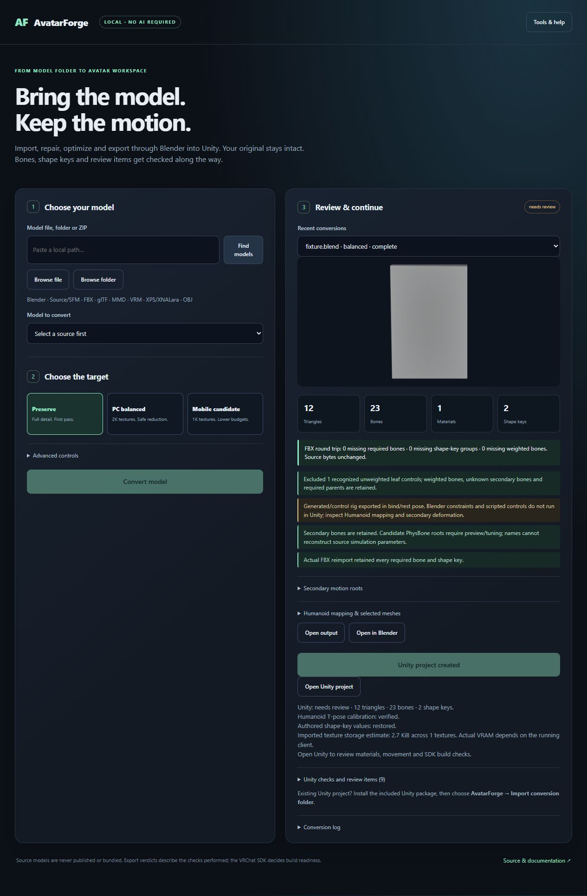
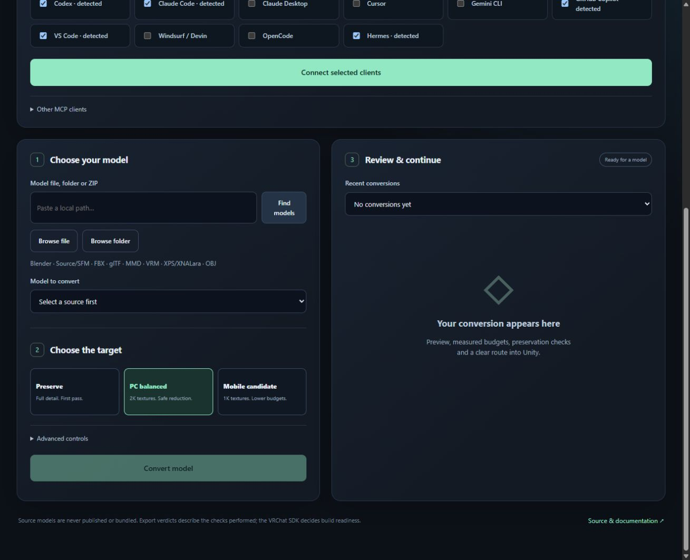

# AvatarForge

Local model-to-avatar workbench: choose a model, convert through Blender, then prepare a Unity/VRChat project. Normal conversions use **no AI, account or API credits**.

**[Download the release](https://github.com/SenjuWoo/AvatarForge/releases/latest)** → extract the AvatarForge ZIP into your apps folder → double-click **INSTALL-TOOLS.bat**. It installs the verified conversion tools and opens the local interface. After setup, use **START-HERE.bat**.

Keep the application in its own folder, outside AI skill directories. **Connect AI** in the interface, or **CONNECT-AI.bat**, registers the optional local tools. Skill folders receive only the small AvatarForge usage skill.

It automates the repeatable work, with real Blender and Unity validation. Reports identify model-specific repair and preview work. An arbitrary model may still need rigging or artistic repair.





Connect AI checks the local server and preserves your existing client settings. Client activation is verified after its restart or reload.

## The normal workflow

1. Browse to a model, its folder, or a ZIP. Choose the intended file when a pack contains several models.
2. Choose **Preserve**, **PC balanced** or **Mobile candidate**, then **Convert model**.
3. Review the preview, bone/shape-key checks, material issues and suggested secondary motion roots.
4. Select the roots you want simulated, then **Prepare Unity prefab & scene**. Wait for the Unity import verdict, then **Open Unity project**. Inspect the prepared avatar and run the official SDK checks.

**Do not import the whole output folder into Unity Assets.** Dragging in `model.fbx` alone skips AvatarForge's material reconstruction, rig calibration, authored shape values and selected PhysBones. `model.blend` belongs outside Assets; Unity may try to launch Blender to import it. For an existing project, add the included Unity package from disk and use **AvatarForge → Import conversion folder**. Open the generated `Preview.unity` scene or `Avatar.prefab`.

A converted FBX normally contains **no animation clips**. This avatar workflow exports bind/rest geometry; VRChat tracking and default playable layers drive a valid prepared Humanoid rig. Blender drivers, constraints and cloth are not Unity animation clips. A Generic creature retains every limb but needs its own animation/controller work.

Project creation and import completion are separate steps. A kept project after a timeout is diagnostic output, not a prepared avatar. Open it, let imports finish, then use the AvatarForge import menu; the app also offers a retry into a new project. The button reports completion only when a current Unity verdict references actual saved prefab and scene files. See [workflow and troubleshooting](docs/workflow.md).

Every conversion writes into a new `outputs/<job>/` folder. Source files are read without enabling embedded Blender scripts; their main file hashes are checked before/after conversion. Background Blender uses an isolated profile. Recent jobs survive an app restart.

If Unity shows overlapping avatars or extra limbs, open the generated `Preview.unity` scene by itself. **Open Unity** does this automatically when the project has no unsaved scene work; otherwise it preserves that work and reports the scene to open.

Supported complex Blender shaders bake automatically on the local CPU. Proven constant channels become material scalars instead of redundant maps; varying color, alpha and surface detail remain at the chosen resolution. Advanced controls can force compatible materials to bake or choose texture extraction only. PC uses 2K bakes and mobile uses 1K; Preserve keeps source textures and uses the reviewed 2K bake size. Importer paths, humanoid overrides, outfit selection and scale can also be specified there.

## What it does

- Imports supported native formats and pinned external importers; detects model candidates instead of executing downloaded SFM rig scripts.
- Resolves available textures, extracts PNGs, caps texture size by preset and flattens supported UDIM sets with UV metadata.
- Selects the mesh-linked character armature, exports bind/rest pose and reports nonportable controls, cloth and constraints.
- Preserves weighted bones, secondary bones and shape keys. Empty FBX skin binding records are removed without deleting bones or changing weighted matrices. It verifies the actual exported FBX by importing it back into Blender, including selected mesh vertex/triangle counts and a check that every expected weighted bone remains weighted.
- Captures authored shape-key values before removing source drivers and restores those values on the saved Unity prefab. Supported deletion masks retain every shape frame and an unmasked mesh backup in the saved Blender file.
- Exports `model.blend`, `model.fbx`, textures, a preview, a conversion manifest and diagnostic logs.
- Maps common Source/Valve, Blender, MMD and conventional humanoid names, with explicit overrides for ambiguity. When extra spine bones leave the neck or a shoulder off the mapped chest, those three bones are parented directly to UpperChest, or to Chest when UpperChest is absent, without moving their bind pose.
- Configures compatible Unity Humanoid import or retains a Generic preview for other rigs, reconstructs materials, creates a prefab/preview scene and adds a VRChat descriptor when the SDK is present.
- Calibrates Unity's Humanoid T-pose and independently checks the saved importer and prepared prefab pose. Missing or ambiguous mappings remain review items.
- Keeps Unity's bone/Transform optimizations disabled so secondary bones remain addressable. Verifies bones, named blendshapes and weighted-bone names again after Unity import.
- Imports Blender's authored blendshape normals with legacy recalculation disabled, and enables streaming mipmaps on referenced mipmapped textures for the SDK handoff.
- Creates selected PhysBone components on secondary roots; it does not infer source simulator tuning from a bone name.
- Bakes supported complex shaders from the source render UV map into export UV0, and offers shape-preserving Unity optimization using established tools. See the dependency and validation documents for the exact installed/tested combinations.

## Formats

| Input | Route |
|---|---|
| `.blend`, `.fbx`, `.glb`, `.gltf`, `.obj`, `.stl`, `.ply` | Blender native import |
| Source/SFM `.mdl`, Source 2 `.vmdl_c` | SourceIO; companion files/materials must be available |
| Source `.smd`, `.dmx` | Blender Source Tools; matching SMD `.vta` morph sidecars import automatically |
| MMD `.pmx`, `.pmd` | MMD Tools |
| `.vrm` | VRM Add-on for Blender |
| XNALara/XPS `.xps`, `.mesh`, `.ascii` | Pinned GPL XPS extension with Blender 5.0+; legacy addons can use Advanced controls |
| `.dae` | Blender 4.5 importer or convert to FBX/glTF; Blender 5.2 removed Collada import |
| ZIP packs from model sites | Extracted into a new folder, then select the model |

For a differently named VTA, set `vta_filepath` in Advanced options; `vta_mesh` selects its reference mesh when several meshes exist. Morph names and nonzero deformation are checked, followed by actual FBX preservation.

SmutBase is a model source, not a file format. Its Blender/Source models use the corresponding route above. Unrigged meshes are imported/exported, but need an armature and skin weights before a Humanoid avatar can be validated. This tool does not create a guaranteed humanoid rig for arbitrary geometry.

## Presets and preservation

**Preserve** skips polygon reduction and texture downscaling. Source-authored visibility and supported deletion masks still determine the exported outfit. **PC balanced** targets 70,000 triangles and 2K textures. **Mobile candidate** targets 15,000 triangles and 1K textures. These are conversion targets, not guaranteed VRChat performance ranks.

Blender decimates only meshes that can be reduced without discarding their shape keys. Protected facial/body meshes use the managed Unity Mesh Simplifier. Meshes with more than four skin influences per vertex remain intact because that reducer cannot represent their weights. A failed preservation check keeps the original mesh and reports the reason. Bones are never deleted merely to meet a performance budget. Complex avatars may still exceed bone, material, texture or PhysBone limits.

Set `target_triangles` in Advanced options for a custom PC/mobile target; the same target carries into Unity. Preserve rejects reduction targets. The Unity verdict shows actual triangles and a distinct-texture storage estimate, which is not a running-client VRAM measurement.

`ready` means the stage's recorded checks passed. `needs_review` means an artifact exists with explicit open items. `blocked` means a required capability or integrity check failed. VRChat SDK build validation is recorded separately; no avatar is uploaded automatically.

## Tools and installation

The Windows installer downloads pinned official archives and verifies their published/recorded checksums before extraction. Tools stay under `.runtime/`; no global PATH, model, trust or AI-provider settings are changed. Re-running installation verifies its local install receipts.

Blender, SourceIO, Source Tools, MMD Tools, VRM and XPS importer downloads can be installed locally. Unity and the VRChat SDK are obtained through their official channels. Unity project creation uses official VPM and the supported editor version, with a new short project path under `%USERPROFILE%\AvatarForgeProjects\`.

The maintained XPS extension is GPL and installs from its pinned official source. Legacy XPS addons with unverified redistribution terms are linked separately. VRCFury uses its own distribution terms and official installer. The full list, licenses and links are in [docs/dependencies.md](docs/dependencies.md). No supplied character model or user Unity project is included in this repository.

Existing Unity project: add `unity/Packages/dev.senjuwoo.avatarforge/package.json` using **Package Manager → Add package from disk**, then **AvatarForge → Import conversion folder**. The importer creates new assets and preserves existing scene work.

This distribution is the complete checkout/ZIP, not a standalone Python wheel. Windows 10/11 x64 is the one-click target. Python 3.10+ can run the CLI on other platforms when compatible Blender/importers are already installed.

## Optional AI and Ultimate AI Starter Bundle

AvatarForge works independently. It pairs with [Ultimate-AI-Starter-Bundle](https://github.com/SenjuWoo/Ultimate-AI-Starter-Bundle) when you want an AI to inspect a report, select meshes, supply a bone map or repair a difficult source in Blender/Unity. No bundle fork or extra always-on engine server is required.

Click **Connect AI**, choose your installed clients and connect. Configuration changes are backed up, merge only AvatarForge's server, and preserve other servers, model choices, tool filters and trust. Reload the client afterward. For project-only access, enter that project folder; unsupported project scopes are reported without changing global settings.

Reviewed Windows adapters cover Codex, Claude Code/Desktop, Cursor, Gemini CLI, GitHub Copilot, VS Code, Windsurf/Devin, OpenCode and Hermes. Hermes uses its installed configuration API and requires the app/gateway to be closed. Unknown clients can use the generated generic stdio entry. A web-only chat needs a compatible local bridge; changing the AI model does not require re-registering AvatarForge.

The small built-in MCP server exposes seven tools: doctor, scan, convert, job, cancel, prepare Unity and action status. Job/status replies are compact by default; request `details=true` only for a full manifest. The generic entry is:

```json
{
  "mcpServers": {
    "avatarforge": {
      "command": "<AvatarForge folder>/.runtime/python/python.exe",
      "args": ["<AvatarForge folder>/run.py", "mcp"]
    }
  }
}
```

Use the client's native configuration format for that entry. For live repair, enable only the bundle's `engine-blender` / `engine-unity` profiles for the relevant project. Their addons/editors must actually be running; installing a server alone is not an editor connection.

Provider format references and configuration/backup behavior: [AI integration](docs/ai-integration.md). Moving the app requires running **Connect AI** again; the owned server paths are updated. Converted blend files use relative texture paths, and new job and tool receipts survive moving the application.

## CLI and checks

```powershell
.\.runtime\python\python.exe run.py doctor
.\.runtime\python\python.exe run.py scan "C:\Models\Character"
.\.runtime\python\python.exe run.py convert "C:\Models\Character\model.blend" --preset balanced
.\.runtime\python\python.exe -m unittest discover -s tests -v
```

The real Blender regression generates its own humanoid/secondary-bone/shape-key/UDIM fixture:

```powershell
blender.exe --background --factory-startup --disable-autoexec --python-exit-code 1 --python tests/blender_smoke.py -- validation/blender-smoke
```

See [VALIDATION.md](VALIDATION.md) for observed engine versions, tested paths and remaining runtime gaps. Third-party dependency/source licenses remain with their authors; AvatarForge's own code is MIT.
